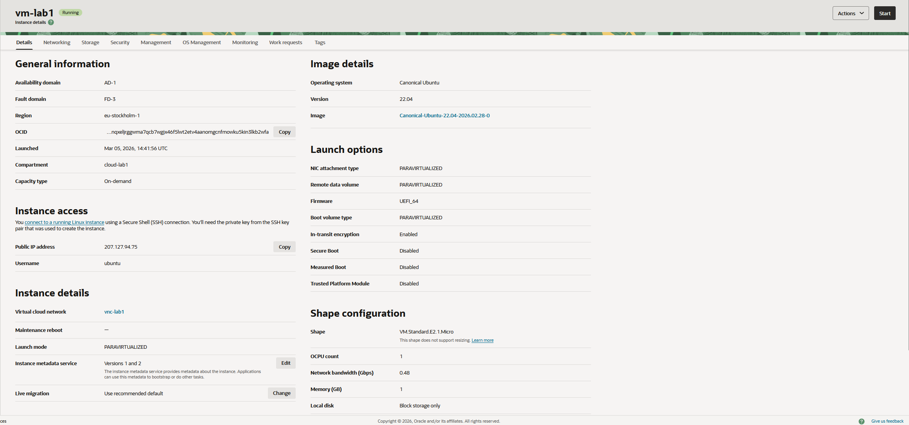
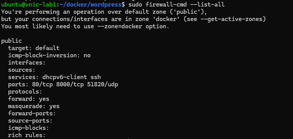
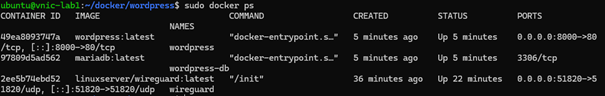
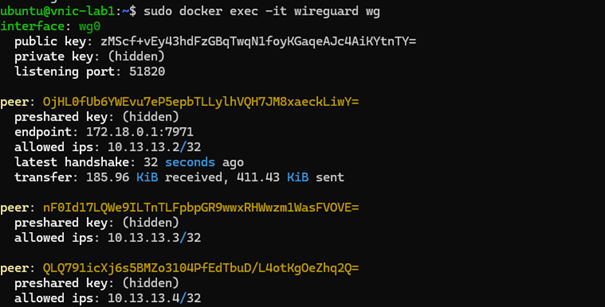
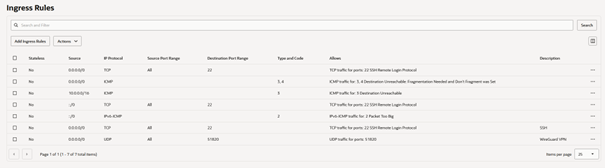

# Lab 1 Report – Cloud Computing / Network Security / System Administration

**Course:** Cloud Computing / Network Security / System Administration (GDT34Z)  
**Platform:** Oracle Cloud Infrastructure (OCI)  
**Operating System:** Ubuntu Linux (ARM64)

---

# 1 Introduction

The goal of this lab was to deploy cloud infrastructure in Oracle Cloud Infrastructure (OCI) and run services using container technology. The main objectives were to create a virtual machine, configure networking, deploy a WireGuard VPN service using Docker, and ensure that at least one client could connect to the VPN. In addition, a web-based Content Management System (CMS) was deployed using containers.

This work demonstrates practical skills in cloud administration, containerization, and network security.

---

# 2 Environment Setup

The first step was to create an account in Oracle Cloud Infrastructure and set up the necessary cloud resources. A compartment named **cloud-lab1** was created to organize the resources used for the lab.

Next, a **Virtual Cloud Network (VCN)** was created with the following configuration:

- IPv4 CIDR block: `10.0.0.0/16`
- IPv6 prefix: `2603:c026:304:4500::/56`

The VCN included:

- Public subnet
- Route tables
- Security lists
- Internet Gateway

A route rule directing all external traffic (`0.0.0.0/0`) to the Internet Gateway was added to enable connectivity.

A compute instance running **Ubuntu Linux (ARM64)** was then deployed.

### Screenshot – OCI Compute Instance



---

# 3 SSH Access and Initial Configuration

Secure Shell (SSH) access was configured using key-based authentication. OCI generated a key pair during instance creation, and the private key was used to connect to the server from a local machine.

Example connection command:

```

ssh -i ssh-key-2026-03-05.key ubuntu@<public-ip>

```

After connecting to the server, the system packages were updated and the firewall service **firewalld** was installed.

The following ports were opened:

| Port | Protocol | Service |
|----|----|----|
| 22 | TCP | SSH |
| 80 | TCP | Web |
| 8000 | TCP | WordPress |
| 51820 | UDP | WireGuard |

### Screenshot – Firewall Configuration



---

# 4 Docker Installation

Docker was installed to run services inside containers.

Commands used:

```

sudo apt update
sudo apt install docker.io docker-compose

```

Docker was then tested to verify that containers could run correctly.

### Screenshot – Running Docker Containers



---

# 5 WireGuard VPN Deployment

A WireGuard VPN server was deployed using a Docker container. A `docker-compose.yml` file was created to configure the container, including port mappings and persistent configuration storage.

The container exposed the VPN service on:

```

UDP port 51820

```

WireGuard automatically generated configuration files for VPN clients. The configuration file `peer1.conf` was imported into the WireGuard client on the local computer.

After activating the VPN connection, the server reported a successful handshake.

### Screenshot – WireGuard Handshake



---

# 6 WordPress CMS Deployment

A web-based **Content Management System (CMS)** was deployed using Docker.

Two containers were used:

- WordPress container
- MariaDB container

The WordPress container exposed **port 8000** so the website could be accessed via:

```

http://<public-ip>:8000

```

The WordPress installation page was successfully loaded in the browser.

### Screenshot – WordPress Installation


---

# 7 Challenges Encountered

## 7.1 SSH Connection Timeout

Initially, SSH connections failed with a timeout error. This was caused by a missing route rule in the VCN. After adding a rule directing traffic (`0.0.0.0/0`) to the Internet Gateway, SSH access worked correctly.

---

## 7.2 Missing Security Rule for WireGuard

The WireGuard client could not initially connect because the OCI security list only allowed SSH traffic.

Adding a rule allowing **UDP port 51820** resolved the issue.

### Screenshot – OCI Security Rules



---

## 7.3 VPN Routing Issues

When connecting to the VPN, internet access was temporarily lost. This occurred because the server was not forwarding traffic from the VPN network.

The issue was resolved by enabling:

```

net.ipv4.ip_forward=1

```

and enabling NAT masquerading in the firewall.

---

# 8 Verification

The deployed services were verified using several commands.

### Docker Containers

```

docker ps

```

### Screenshot – Container Status


---

### WireGuard VPN

```

sudo docker exec -it wireguard wg

```

The output showed a **recent handshake and data transfer**, confirming that the VPN connection worked.

### Screenshot – VPN Handshake


---

### WordPress CMS

The CMS was verified by accessing:

```

http://<public-ip>:8000

```

### Screenshot – WordPress Dashboard

The WordPress installation page was successfully loaded in the browser,
confirming that the web server and database containers were running correctly.


---

# 9 Conclusion

This lab demonstrated how cloud infrastructure can be deployed and managed using Oracle Cloud Infrastructure.

A Linux ARM64 virtual machine was configured with networking, firewall rules, and Docker container support. A WireGuard VPN server was deployed to provide secure remote access. Additionally, a WordPress CMS with a MariaDB database was deployed using Docker Compose.

Several networking challenges were encountered during the setup process, including route table configuration, firewall rules, and VPN routing. These issues were resolved through troubleshooting and configuration adjustments.

Overall, the lab provided valuable hands-on experience with cloud networking, containerized services, and secure remote connectivity.
```
