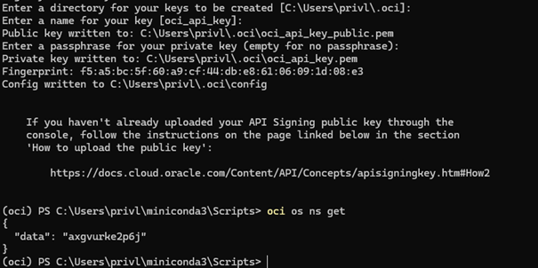

# Lab 2 – Oracle Cloud Infrastructure (OCI)

This lab demonstrates how to deploy and manage cloud infrastructure in Oracle Cloud Infrastructure (OCI).  
The tasks include configuring OCI CLI, attaching block storage, deploying a web server, using object storage, retrieving secrets from OCI Vault, enabling flow logs, and configuring monitoring alarms.

---

# 0. Compute Instance

A compute instance was created using Terraform and is running in OCI.


---

# 1. OCI CLI Configuration

The OCI CLI was configured to allow interaction with OCI services from the command line.  
An API key was generated and added to the OCI configuration.

The namespace of the object storage service was retrieved using:

```

oci os ns get

```

This confirmed that the CLI authentication was working correctly.



---

# 2. Block Storage Volume Mounting

A block storage volume was attached to the compute instance.  
The volume was mounted to `/mnt/block`.

Commands used:

```

sudo mkdir /mnt/block
sudo mount /dev/sdb /mnt/block

```

Disk usage was verified using:

```

df -h

```


The block device layout was also verified.

```

lsblk

```


---

# 3. Persistent Mount Configuration

To ensure the block volume remains mounted after reboot, the `/etc/fstab` file was updated with the device UUID.

Command used:

```

cat /etc/fstab

```

The configuration shows the mounted block volume using its UUID.


---

# 4. Web Server Deployment

A web server was installed and configured on the compute instance.  
The server successfully served a webpage accessible through the instance public IP.

The browser displays the web page confirming the web server is operational.


---

# 5. Object Storage Bucket

An Object Storage bucket named `lab2-bucket` was created.  
Objects were uploaded to verify the functionality of the bucket.


This confirms that object storage is correctly configured and accessible.


---

# 6. OCI Vault Secret Management

A secret was stored in OCI Vault and retrieved using a Python script that authenticates using instance principals.

The script used the OCI Python SDK to retrieve the secret.

Command executed:

```

python3 oci_vault_test1.py

```

Output:

```

This is probably super secret!

```


This demonstrates secure secret retrieval without embedding credentials in the application.

---

# 7. VCN Flow Logging

VCN Flow Logs were enabled to capture network traffic information within the Virtual Cloud Network.

The flow logs were stored in the OCI Logging service.


This allows monitoring of network activity such as source and destination IP addresses and allowed traffic.


---

# 8. Monitoring Alarm Configuration

An OCI Monitoring alarm was created to detect high CPU utilization on the compute instance.

Alarm configuration:

- Metric: `CpuUtilization`
- Threshold: `> 80%`
- Interval: `1 minute`
- Severity: `Critical`


---

# 9. Alarm Trigger Test

To test the alarm, CPU load was generated using the following command:

```

stress --cpu 2 --timeout 300

```

This command increases CPU usage to trigger the alarm condition.


---

# 10. Alarm Notification

Once the CPU usage exceeded the threshold, the alarm was triggered and a notification email was sent.

The email confirms the alarm state changed to **FIRING**.


---

# Conclusion

This lab demonstrated the deployment and management of cloud resources in Oracle Cloud Infrastructure.  
Key components such as compute instances, block storage, object storage, vault secrets, logging, and monitoring alarms were successfully configured and tested.

The lab highlights how OCI provides secure, scalable, and manageable infrastructure for cloud-based applications.
