# Lab 2 – Oracle Cloud Infrastructure (OCI)

**Course:** Cloud Computing / Network Security / System Administration (GDT34Z)

**Platform:** Oracle Cloud Infrastructure (OCI)

**Operating System:** Ubuntu Linux (ARM64)

---

# Introduction

This lab demonstrates how to deploy and manage cloud infrastructure in Oracle Cloud Infrastructure (OCI). The focus is on applying practical cloud concepts such as Infrastructure as Code (IaC), storage configuration, identity and access management, logging, and monitoring.

The tasks performed in this lab reflect essential cloud operations, including automation, security, and observability in a real-world environment.

The following mandatory tasks were completed:

* 2.2.1 Infrastructure as Code (Terraform)
* 2.3 Block Storage Configuration
* 2.4.1 Object Storage and Manual Access
* 2.7.1 Cloud Logging
* 2.8.1 Monitoring, Alarms and Notifications

---

## 2.2.1 Infrastructure as Code (Terraform)

A Terraform-based environment was configured to enable automated provisioning of cloud infrastructure in Oracle Cloud Infrastructure (OCI). This demonstrates how infrastructure can be defined and deployed programmatically, improving consistency and reducing manual errors.

Terraform was used to declaratively define resources, while authentication was handled through the OCI CLI configuration to ensure secure access.

### Configuration

Variables were used to increase flexibility and reusability:

* Compartment ID
* Availability domain
* Network CIDR ranges
* Instance shape
* SSH public key

This allows the same configuration to be reused across environments.

### Provisioned Infrastructure

The following resources were created:

* Virtual Cloud Network (VCN)
* Subnet
* Internet Gateway
* Route Table
* Security rules (SSH access)
* Compute instance

The compute instance was deployed with:

* Ubuntu 22.04
* VM.Standard.E2.1.Micro
* eu-stockholm-1 region
* Public IP enabled

### Deployment Process

```bash
terraform init
terraform plan
terraform apply
```

### Result

The instance was successfully deployed and accessible via SSH.

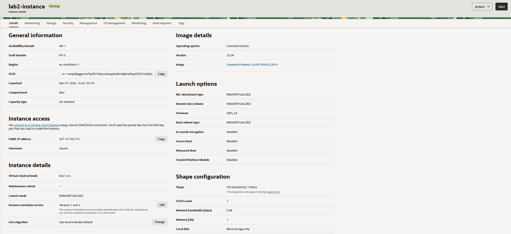

This confirms that the infrastructure was provisioned entirely through code.

---

## 2.3 Block Storage Configuration

A block storage volume was attached to the compute instance to extend storage capacity.

### Mounting the Volume

```bash
sudo mkdir /mnt/block
sudo mount /dev/sdb /mnt/block
```

Verification:

```bash
df -h
```

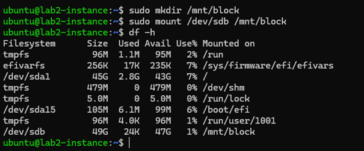

Block device layout:

```bash
lsblk
```

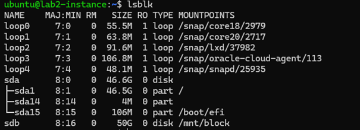

### Persistent Mount

To ensure persistence after reboot, `/etc/fstab` was configured using UUID.

```bash
cat /etc/fstab
```

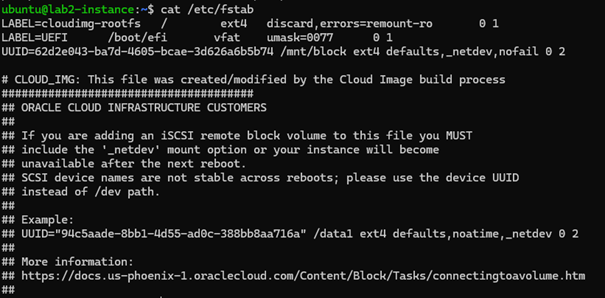

### Result

The volume was successfully mounted and persisted across reboots.

---

## 2.4.1 Object Storage and Manual Access

### Bucket Creation

An Object Storage bucket named `lab2-bucket` was created and used to upload files.

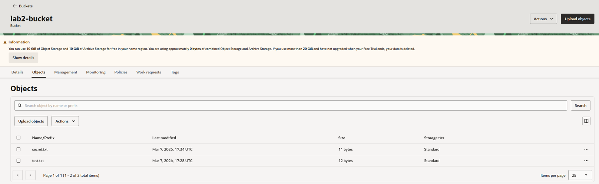

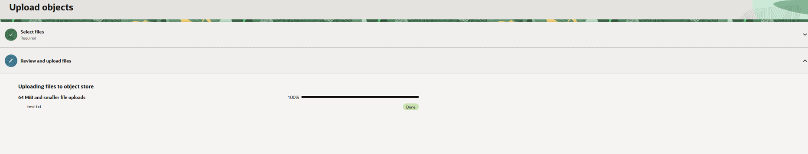

---

### IAM User and Policy Configuration

A new IAM user with limited privileges was created to follow the principle of least privilege.

Steps performed:

* Created a user
* Generated Customer Secret Keys
* Created a group and added the user
* Created a policy:

```
Allow group <group-name> to manage all-resources in compartment <compartment-name>
```

---

### Public Bucket Access

A public object was uploaded and accessed via a browser.


---

### Private Bucket Access

Access to a private bucket was tested using S3-compatible tools.

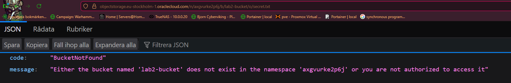

### Result

Both public and private access methods were successfully verified.

---

## 2.5 Vault and Secret Management (Optional)

As an additional task, OCI Vault was used to securely store and manage sensitive data such as secrets and encryption keys.

A Vault named `lab2-vault` was created, and a master encryption key (`lab2-key`) was generated and enabled. This key is used to encrypt and protect stored secrets within the Vault.

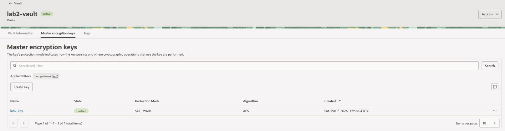

To validate the functionality, a secret was stored in the Vault and retrieved programmatically using a Python script with the OCI SDK.

The OCI Python SDK was installed and used to access the Vault:

```bash
pip3 install oci
python3 oci_vault_test1.py
```

The script successfully retrieved the stored secret:

This is probably super secret!

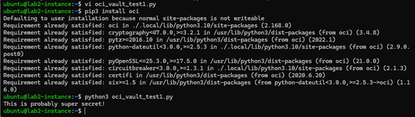

This confirms that secrets can be securely stored and accessed without exposing sensitive information directly in application code.

The OCI Vault provides centralized and secure management of secrets and encryption keys. By retrieving secrets programmatically instead of hardcoding them, the risk of credential leakage is significantly reduced. This is an important security practice in modern cloud environments.


## 2.7.1 Cloud Logging (VCN Flow Logs)

VCN Flow Logs were enabled to capture network traffic within the subnet.

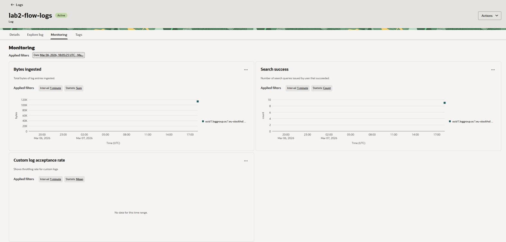

### Logged Data

The logs include:

* Source IP
* Destination IP
* Traffic status (allowed/denied)

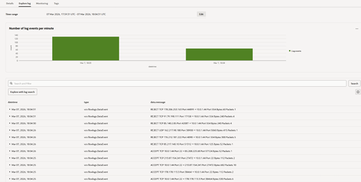

### Result

Network traffic was successfully captured and logged, confirming that logging is working correctly.

---

## 2.8.1 Monitoring, Alarms and Notifications

### Alarm Configuration

An OCI Monitoring alarm was created with:

* Metric: CpuUtilization
* Threshold: > 80%
* Interval: 1 minute
* Severity: Critical

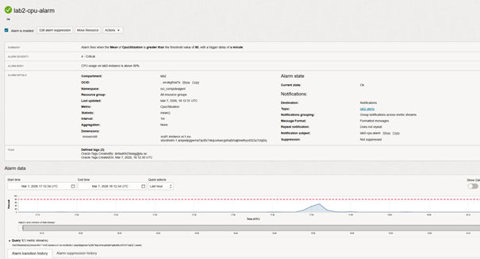

---

### Alarm Trigger Test

CPU load was generated:

```bash
stress --cpu 2 --timeout 300
```

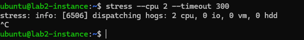

---

### Notification

An email notification was received after the alarm was triggered.

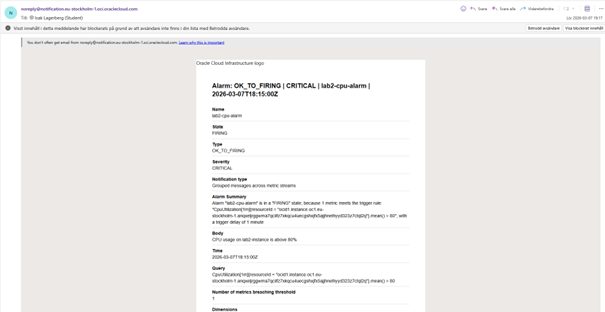

### Result

Monitoring and alerting were successfully configured and validated.

---

# Conclusion
This lab demonstrated the deployment and management of cloud resources in Oracle Cloud Infrastructure (OCI), with a focus on automation, security, and operational visibility.

The required tasks (2.2.1, 2.3, 2.4.1, 2.5, 2.7.1, and 2.8.1) were successfully completed, covering key areas such as:

Infrastructure provisioning using Terraform (Infrastructure as Code)
Persistent block storage configuration
Object storage with IAM-based access control
Network traffic logging using VCN Flow Logs
Monitoring, alarms, and automated notifications

Together, these tasks illustrate how different OCI services integrate to form a complete cloud environment. The use of Infrastructure as Code improves consistency and repeatability, while IAM policies and logging enhance security and traceability.

Overall, the results demonstrate that OCI provides a secure, scalable, and flexible platform for managing cloud infrastructure, supporting both automated deployments and robust monitoring capabilities essential for modern cloud operations.
