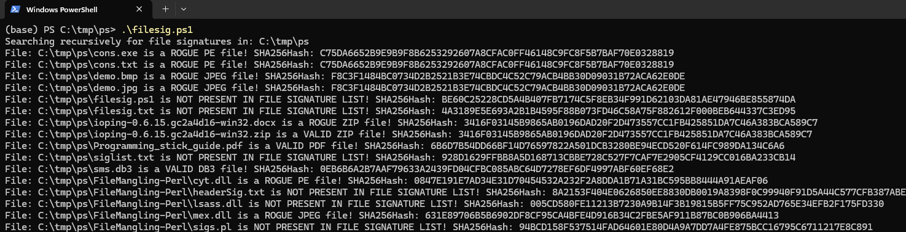

# Lab 3 – PowerShell: File Signature Analysis

## Introduction

The purpose of this lab is to develop a PowerShell script that analyzes files based on their **file signatures (magic numbers)** and compares them to their file extensions.

This technique is commonly used in **system administration and digital forensics** to detect tampered or suspicious files.

The script should:

* Read file signatures from a configuration file
* Recursively scan a directory
* Identify file types based on content
* Compare detected type with file extension
* Classify files as **VALID**, **ROGUE**, or **UNKNOWN**

---

## Environment and Tools

* PowerShell 7
* Visual Studio Code with PowerShell Extension
* Test files from `ps.7z`

---

## Signature File Structure

The signature file (`siglist.txt`) contains file types with their corresponding headers and optional footers:

```txt
PE;4D5A;
JPEG;FFD8;FFD9;
PDF;25504446;
ZIP;504B;
DB3;53514C69;
```

Each row follows the format:

```
FileType;Header;Footer
```


---

## Methodology

The script performs the following steps:

1. Load file signatures into memory
2. Retrieve all files recursively from the target directory
3. Read only the necessary parts of each file (header and footer) using file streams
4. Convert the extracted bytes into hexadecimal format
5. Compare file headers and footers with known signatures
6. Extract file extension
7. Compute SHA256 hash
8. Output classification results

---

## Full PowerShell Script

```powershell
# Load signatures
$siglist = @{}
$sigFile = "$PSScriptRoot\siglist.txt"

Get-Content $sigFile | ForEach-Object {
    $parts = $_ -split ";"
    if ($parts.Length -ge 2) {
        $type = $parts[0].ToUpper()
        $header = $parts[1]
        $footer = $parts[2]

        $siglist[$type] = @{
            Header = $header
            Footer = $footer
        }
    }
}

# Target directory
$targetPath = "C:\tmp\ps"

Write-Output "Searching recursively for file signatures in: $targetPath"

$files = Get-ChildItem $targetPath -Recurse -File

foreach ($file in $files) {

    try {
        # Open file stream
        $stream = [System.IO.File]::OpenRead($file.FullName)

        # Read first bytes (header)
        $headerBytes = New-Object byte[] 8
        $stream.Read($headerBytes, 0, 8) | Out-Null

        # Read last bytes (footer)
        $footerBytes = New-Object byte[] 8
        $stream.Seek(-8, 'End') | Out-Null
        $stream.Read($footerBytes, 0, 8) | Out-Null

        $stream.Close()

        # Convert to hex
        $headerHex = ($headerBytes | ForEach-Object { $_.ToString("X2") }) -join ""
        $footerHex = ($footerBytes | ForEach-Object { $_.ToString("X2") }) -join ""

        $match = $null

        foreach ($type in $siglist.Keys) {
            $header = $siglist[$type].Header
            $footer = $siglist[$type].Footer

            if ($headerHex.StartsWith($header)) {
                if ($footer -and $footerHex.EndsWith($footer)) {
                    $match = $type
                    break
                }
                elseif (-not $footer) {
                    $match = $type
                    break
                }
            }
        }

        $extension = $file.Extension.TrimStart(".").ToUpper()
        $hash = Get-FileHash $file.FullName -Algorithm SHA256

        if ($match) {
            if ($match -eq $extension) {
                Write-Output "File: $($file.FullName) is a VALID $match file! SHA256Hash: $($hash.Hash)"
            }
            else {
                Write-Output "File: $($file.FullName) is a ROGUE $match file! SHA256Hash: $($hash.Hash)"
            }
        }
        else {
            Write-Output "File: $($file.FullName) is NOT PRESENT IN FILE SIGNATURE LIST! SHA256Hash: $($hash.Hash)"
        }
    }
    catch {
        Write-Output "Error reading file: $($file.FullName)"
    }
}
```

---

## Running the Script

Execute the script in PowerShell:

```powershell
.\filesig.ps1
```

---

## Example Output

Below is the output from running the script:



The output shows three types of classifications:

* **VALID** – The file signature matches the file extension
* **ROGUE** – The file signature does not match the file extension (indicating possible file manipulation)
* **NOT PRESENT** – The file type is not included in the signature list

---

## Analysis

The results clearly demonstrate how file signatures can reveal the true nature of files regardless of their extensions.

Several important observations can be made:

* Files such as `.zip`, `.pdf`, and `.db3` were correctly identified as **VALID**, meaning their internal structure matches their file extension
* Multiple files were identified as **ROGUE**, such as `.txt`, `.bmp`, and `.docx` files that actually contained executable, JPEG, or ZIP data
* This indicates **file mangling**, where files have been renamed to disguise their true type
* Some files were classified as **NOT PRESENT**, meaning their signatures were not defined in the `siglist.txt` file

A particularly important case is when a file appears visually correct (e.g., `.jpg`) but is still classified as **ROGUE**, which may indicate:

* Corrupted files
* Incomplete file data
* Incorrect or missing footer signatures

This demonstrates that relying solely on file extensions is unreliable and potentially dangerous in security-sensitive environments.

---

## Limitations

* Reads only a small portion of each file (header and footer), which improves performance but may not detect more complex file structures
* Depends on accuracy of `siglist.txt`
* Limited to header/footer matching

---

## Improvements

Possible improvements include:

* Supporting more advanced file signature analysis beyond simple header/footer matching
* Adding support for more file types
* Exporting results to a log file
* Adding colored output for readability
* Implementing parallel processing

---

## Conclusion

This lab provided practical experience with:

* PowerShell scripting
* Binary data processing
* File signature analysis

The script successfully identifies mismatches between file content and file extension and demonstrates how file signatures can be used to detect manipulated or suspicious files.

---

## Feedback

### a) Relevance

The lab is relevant as it provides hands-on experience with analyzing file signatures and detecting file type mismatches. It specifically highlights how easily file extensions can be manipulated and why relying on file content is more reliable when identifying potentially malicious or disguised files.

### b) Suggested Improvements

It would be interesting to include learning or usage of tools that can filter and analyze data based on binary structures, similar to Windows Registry tools. This could give a deeper understanding of how low-level data inspection is applied in real-world systems.

---
